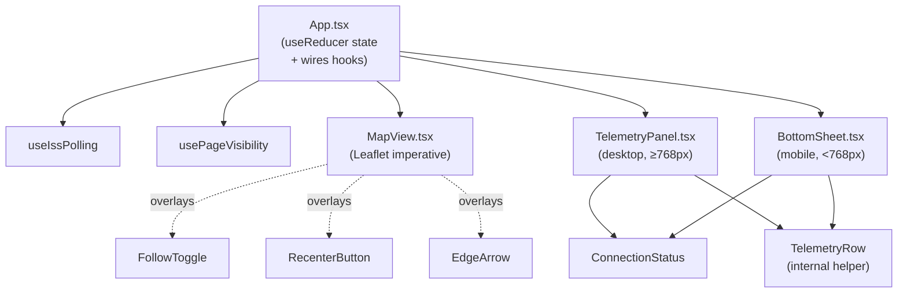

# Component Design — ISS Tracker UI

> Last updated: 2026-06-02
> Status: initial draft (iteration 1, pre-implementation)
> Serves: prd-001 (all P0 CUJs)
> See also: `system.md` (canonical tech, state, polling, animation, antimeridian, error handling)

## 1. Overview

This document describes every React component file in `src/components/` and the two hooks in `src/hooks/`. It defines:
- What each component renders.
- What props it takes and what state it owns (spoiler: almost nothing).
- Where each PRD CUJ's behavior is wired up.
- How desktop and mobile chrome share code.

The overarching pattern: **`App.tsx` owns 100% of the state via a single `useReducer`. Every component below it is presentational.** The only stateful hooks are `useIssPolling` and `usePageVisibility`, both of which dispatch into the reducer.

## 2. Goals & Non-Goals

**Goals (engineering):**
- Components must be readable in one screen each. If a file exceeds ~250 lines, split.
- The desktop and mobile layouts share every primitive (FollowToggle, RecenterButton, ConnectionStatus pill, telemetry-row formatting). Only the *containers* (TelemetryPanel vs BottomSheet) differ.
- No component contains polling, timing, or Leaflet imperatives except `MapView`.
- Every component's props are explicit (no Context for app state).

**Non-goals:**
- No design system / component library. Tailwind classes inline are fine for an app of this size.
- No internationalization. Strings inline. (If i18n is added later, extract to a single `strings.ts`.)
- No animation libraries (Framer Motion etc.). CSS keyframes + `transition` are enough.

## 3. Component Map



The dotted lines for FollowToggle/Recenter/EdgeArrow indicate they are rendered as *siblings* of the Leaflet map container, absolutely positioned over it. They are NOT children of `<MapContainer>`.

## 4. App.tsx — the orchestrator

**Responsibilities:**
- Holds `useReducer(reducer, initialState)`.
- Mounts the hooks: `useIssPolling(dispatch, isVisible)`, `usePageVisibility(dispatch)`.
- Mounts the 1-second `TICK` interval.
- Detects viewport width (single `useState` + `matchMedia(${BREAKPOINT_MOBILE_PX})` listener) → renders either `TelemetryPanel` or `BottomSheet`.
- Renders the layout shell: a flex/grid container that places `MapView` on the left/full-screen and the panel/sheet on the right/bottom.
- Provides callbacks (e.g., `onFollowToggle`, `onRecenter`, `onMapInteract`, `onToggleSheet`) that wrap `dispatch`.

**Pseudocode (illustrative — implementation may differ in mechanics, not shape):**

```tsx
export function App() {
  const [state, dispatch] = useReducer(reducer, initialState);
  const isVisible = usePageVisibility(dispatch);
  useIssPolling(dispatch, isVisible);
  useTickInterval(dispatch, isVisible);
  const isMobile = useIsMobile(); // matchMedia(BREAKPOINT_MOBILE_PX)

  const handleFollowToggle = () =>
    dispatch({ type: 'SET_FOLLOW', follow: !state.follow, userInitiated: true });
  const handleRecenter = () =>
    dispatch({ type: 'SET_FOLLOW', follow: true, userInitiated: true });
  const handleMapInteract = () => dispatch({ type: 'MAP_INTERACTED' });
  const handleMarkerVisibilityChange = (onScreen: boolean) =>
    dispatch({ type: 'MARKER_VISIBILITY_CHANGE', onScreen });

  return (
    <div className="relative h-screen w-screen overflow-hidden bg-[#0d1117]">
      <MapView
        state={state}
        onMapInteract={handleMapInteract}
        onMarkerVisibilityChange={handleMarkerVisibilityChange}
      >
        <FollowToggle follow={state.follow} onToggle={handleFollowToggle} />
        {!state.follow && !state.isMarkerOnScreen && state.current && (
          <>
            <EdgeArrow current={state.current} mapViewportRef={...} />
            <RecenterButton onRecenter={handleRecenter} isMobile={isMobile} />
          </>
        )}
      </MapView>

      {isMobile ? (
        <BottomSheet
          state={state}
          onToggleSheet={() => dispatch({ type: 'TOGGLE_SHEET' })}
          onCollapse={() => dispatch({ type: 'COLLAPSE_SHEET' })}
        />
      ) : (
        <TelemetryPanel state={state} />
      )}

      <Attribution />
      <FollowOffToast show={state.follow === false && !state.hasShownFollowToast} />
    </div>
  );
}
```

**Notes:**
- `useTickInterval` is small enough that it can live inline in `App.tsx` (avoid creating a hook file just for it).
- `FollowOffToast` is not in the file list above — recommendation: render it inline inside `App.tsx` (10 lines). Don't create a separate file.
- `Attribution` is one `<div className="absolute bottom-3 left-4 text-xs text-slate-500">Data: wheretheiss.at · Map: OpenStreetMap</div>`. Inline; don't extract.

## 5. MapView.tsx — the imperative bridge

**Responsibilities:**
- Mounts `<MapContainer>` + `<TileLayer>` from react-leaflet.
- On map-ready, grabs the Leaflet `Map` instance via `whenReady` callback and stores it in a ref.
- Creates marker (`L.marker` with custom `divIcon`) and trail polylines (`L.polyline` array) once, on mount.
- Listens to map events: `movestart` / `zoomstart` (user-initiated → `onMapInteract()`), `moveend` (recompute marker on-screen-ness → `onMarkerVisibilityChange`).
- On `state.current` change: schedules the marker tween (see system.md §6.1).
- On `state.trail` change: rebuilds the per-segment polyline layers.
- On `state.follow` change to true OR new `state.current` arrives while `follow=true`: `map.flyTo([lat, lon], ISS_LOCK_ZOOM, { duration })`.

**Critical implementation details:**
- **Differentiating user-initiated pan from programmatic `flyTo`-induced events.** Leaflet's `move` events fire for both. Strategy: set a ref `isProgrammaticMove = true` before any `flyTo` / `setView` call, then unset it inside the next `moveend`. Inside `movestart`, only call `onMapInteract()` if `!isProgrammaticMove`.
- **Marker on-screen check.** On `moveend`, compute `map.getBounds().contains([current.lat, current.lon])`. Dispatch only when the boolean changes.
- **Edge-arrow positioning** is owned by `EdgeArrow.tsx`, but it needs to read the current map viewport. Pass the `Map` instance ref down to it (or pass a callback that converts lat/lon to screen pixels).

**Props:**
```ts
type MapViewProps = {
  state: State;
  onMapInteract: () => void;
  onMarkerVisibilityChange: (onScreen: boolean) => void;
  children?: React.ReactNode;  // overlay chrome rendered inside the map container
};
```

**Anti-patterns to avoid:**
- Do NOT use react-leaflet's `<Marker>` or `<Polyline>` — they reconcile on every render, which breaks rAF tweens.
- Do NOT call `setState` from inside a Leaflet event handler (re-render cascade). Use `dispatch` instead — it's batched.

## 6. TelemetryPanel.tsx — desktop side panel

**Responsibilities:**
- Fixed-position panel on the right, 360px wide, full height.
- Renders (in order, top-down):
  1. `<ConnectionStatus>` — pill ("LIVE" green / "RECONNECTING" amber).
  2. Header "ISS — Zarya" + sub-line ("Live tracking" or "Reconnecting…").
  3. Six `<TelemetryRow>`s in a vertical stack (or grouped per mock: a Position group of 3 + a Telemetry group of 2 + a Footer card for "Last updated").
  4. Inline reconnect message (when `status === 'reconnecting'`).
- Hover tooltips on each row (P1 — see CUJ-3 step 3). Implementation: native `<abbr title="…">` or a simple custom CSS tooltip on `:hover`. No tooltip library.

**Layout per mocks:**
- Panel: `bg-[#11161f]`, left border `1px solid rgba(240,246,252,0.06)`.
- Panel header padded `22px`, then sections each padded `0 22px` with `18px` spacing.

**Props:**
```ts
type TelemetryPanelProps = { state: State };
```

The panel reads everything it needs from `state`. No callbacks: it has no interactive elements.

## 7. BottomSheet.tsx — mobile telemetry

**Responsibilities:**
- Fixed-position at bottom; full width.
- Two states: collapsed (~80px tall) and expanded (~50vh).
- Collapsed: compact bar with live dot + compact lat/lon + visibility icon + "Xs ago".
- Expanded: drag handle + header + 2-column grid of six `<TelemetryRow>`s.
- Transition: `transition-[height] duration-300 ease-out`.
- Tap on collapsed bar → expand. Tap on chevron or drag handle in expanded → collapse. (Drag-to-collapse is nice-to-have; not blocking — see open questions.)
- Tap outside the sheet (on the map): `onCollapse()`. Wire this via a `onClick` on the map container area in `App.tsx`, or — simpler — on a transparent overlay div mounted between map and sheet when sheet is expanded.
- Respects `env(safe-area-inset-bottom)` via padding.

**Props:**
```ts
type BottomSheetProps = {
  state: State;
  onToggleSheet: () => void;
  onCollapse: () => void;
};
```

**Notes:**
- The bottom sheet is RENDERED conditionally only when `isMobile === true`. It is never mounted on desktop (avoid wasted DOM).
- Landscape mobile: keep the bottom sheet, just shorter (~64px collapsed). The `useIsMobile` hook returns true for any viewport <768px regardless of orientation, which is the correct behavior per PRD CUJ-4 step 4.

## 8. Smaller components

### 8.1 FollowToggle.tsx

```ts
type FollowToggleProps = {
  follow: boolean;
  onToggle: () => void;
};
```

- Pill-shaped, `role="switch"`, `aria-checked={follow}`, `aria-label="Follow ISS"`.
- Cyan border when on, gray when off.
- ~120px × 32px on desktop, ~108px × 30px on mobile (uses Tailwind responsive classes).
- Positioned absolute top-right by parent (`MapView`'s overlay area).

### 8.2 RecenterButton.tsx

```ts
type RecenterButtonProps = {
  onRecenter: () => void;
  isMobile: boolean;
};
```

- 48px (desktop) / 44px (mobile) cyan circle FAB.
- `aria-label="Recenter map on ISS"`.
- Position differs:
  - Desktop: `bottom: 38px; right: 16px` (above attribution).
  - Mobile: `bottom: calc(80px + env(safe-area-inset-bottom) + 16px); right: 16px` (above collapsed sheet).
- Fade-in/out animation: `transition-opacity duration-200` driven by mount/unmount.

### 8.3 EdgeArrow.tsx

```ts
type EdgeArrowProps = {
  current: IssSample;
  mapRef: React.RefObject<L.Map | null>;
};
```

- Renders a cyan chevron/arrow at the viewport edge nearest the marker.
- Computation: get `mapRef.current!.getCenter()`, project `current.lat/lon` to a pixel direction vector, clip to viewport rectangle with 16px inset.
- Re-computes on `moveend` and on each new `state.current`. Receives `mapRef` so it can do the projection itself; or alternatively, `MapView` computes and passes `{x, y, rotation}` as props.
- **Recommendation: do the projection inside `EdgeArrow`** using `mapRef.current!.latLngToContainerPoint()`. Keeps `MapView` smaller.
- Animation: subtle 1.6s horizontal "nudge" pulse per mock.

### 8.4 ConnectionStatus.tsx

```ts
type ConnectionStatusProps = {
  status: ConnectionStatus;
  // Optional: an inline message + spinner when status === 'reconnecting'.
  // For v1, the inline reconnect message can be rendered by the parent panel/sheet,
  // and this component only renders the pill.
};
```

- Pill: green "LIVE" with pulsing dot, OR amber "RECONNECTING" with slower pulsing dot.
- `aria-live="polite"`, `aria-atomic="true"`.
- ~30 lines of JSX.

### 8.5 TelemetryRow (internal helper, NOT a separate file)

This is a function defined inside `TelemetryPanel.tsx` (and possibly re-used by `BottomSheet.tsx` via a shared helper module if duplication becomes painful). For v1, **duplicate the ~15-line component in both files.** This is honest cost and keeps the file count down.

```ts
type TelemetryRowProps = {
  label: string;
  value: React.ReactNode;
  unit?: string;
  icon?: React.ReactNode;
  isStale?: boolean;       // when true, value rendered in muted color
};
```

If `TelemetryRow` ever becomes more complex (e.g., tooltip logic), extract to `components/TelemetryRow.tsx`. Not now.

### 8.6 Formatting helpers

Live in `state.ts` (alongside the reducer that produces the values) or in a tiny inline helpers section at the top of `TelemetryPanel.tsx`. Functions needed:

```ts
formatLat(lat: number): string;       // "50.1° N" / "50.1° S"
formatLon(lon: number): string;       // "118.1° E" / "118.1° W"
formatKm(km: number): string;         // "408 km"
formatKmh(kmh: number): string;       // "27,600 km/h"
formatRelative(ms: number): string;   // "just now" / "5s ago" / "1m 12s ago" / "32s ago — stale"
```

`formatRelative` is the only non-trivial one — accepts a delta in ms and the stale threshold:
- < 2s: "just now"
- < 60s: `${s}s ago` (+ ` — stale` if delta > 30s)
- < 3600s: `${m}m ${s}s ago` (always stale at this point — yes, append the suffix)
- ≥ 3600s: `${h}h ${m}m ago` (always stale)

## 9. Hooks

### 9.1 useIssPolling.ts

```ts
function useIssPolling(dispatch: React.Dispatch<Action>, isVisible: boolean): void;
```

**Internals:**
- `useEffect` keyed on `[isVisible]`.
- Maintains refs: `timeoutRef`, `abortControllerRef`, `consecutiveFailuresRef`.
- When `isVisible` becomes true: kick off immediate fetch.
- When `isVisible` becomes false: `abortControllerRef.current?.abort()`, `clearTimeout(timeoutRef.current)`.
- After each fetch: schedule next via `setTimeout(tick, delayFor(consecutiveFailuresRef.current))`.
- Dispatches `POLL_START` before fetch, `SAMPLE_OK | SAMPLE_FAIL` after.

**Why the consecutive-failures count is kept BOTH in state AND a ref:** the state is for UI; the ref is for the polling closure (avoids re-creating the entire `useEffect` on every state change). On each `SAMPLE_OK`/`SAMPLE_FAIL`, update both.

### 9.2 usePageVisibility.ts

```ts
function usePageVisibility(dispatch: React.Dispatch<Action>): boolean;
```

- Subscribes to `document.visibilitychange`.
- Returns `document.visibilityState === 'visible'`.
- Dispatches `VISIBILITY_CHANGE` action when it changes (allows reducer to react if needed; in practice it may be unused, but the dispatch is cheap and the option is valuable).

## 10. Data Flow per CUJ

### CUJ-1: First load
1. `App` mounts → reducer initial state (`current: null, status: 'idle', follow: true`).
2. `MapView` mounts Leaflet with `INITIAL_MAP_CENTER` + `INITIAL_MAP_ZOOM`. Tiles begin loading.
3. `useIssPolling` fires first fetch (within 200ms).
4. `TelemetryPanel`/`BottomSheet` render placeholders ("—", "Locating ISS…") because `current === null`.
5. API responds → reducer sets `current`, status `'live'`, trail = `[point]`.
6. `MapView` effect: detects `previous === null` → fade-jump marker to current position. `flyTo(current, ISS_LOCK_ZOOM, 1.0s)` because follow=true.
7. Subsequent polls: `previous` non-null + gap < 8s → tween. Trail grows.

### CUJ-2: Follow off / recenter
1. User pans → Leaflet `movestart` (with `isProgrammaticMove=false`) → `onMapInteract()` → `dispatch MAP_INTERACTED` → reducer sets `follow: false, hasShownFollowToast: true` (toast appears for 2s, then `hasShownFollowToast` is sticky — toast renders only the first time per session).
2. Each poll: reducer no longer sets a `flyTo` trigger; `MapView` checks `state.follow` before `flyTo`.
3. Each `moveend`: `MapView` recomputes on-screen-ness. If off-screen → `dispatch MARKER_VISIBILITY_CHANGE { onScreen: false }`. `EdgeArrow` + `RecenterButton` mount.
4. User taps Recenter → `dispatch SET_FOLLOW {follow:true}` → `MapView` effect: `flyTo(current, ISS_LOCK_ZOOM, 1.5s)`. After fly completes (or on next sample), `moveend` re-checks on-screen-ness → reducer sets `isMarkerOnScreen: true` → `EdgeArrow`/`Recenter` unmount with fade.

### CUJ-3: Telemetry
- `TelemetryPanel` reads `state.current` and renders six rows.
- `state.nowMs` (updated every 1s by the tick interval) drives the relative-time string.
- Visibility row renders icon (sun/moon) based on `state.current.visibility`.

### CUJ-4: Mobile sheet
- `useIsMobile` determines `BottomSheet` is rendered instead of `TelemetryPanel`.
- `state.isSheetExpanded` controls the collapsed/expanded variant.
- `BottomSheet` itself owns no state; it dispatches `TOGGLE_SHEET` / `COLLAPSE_SHEET`.
- `RecenterButton` repositions via its `isMobile` prop.

### CUJ-5: Reconnect
- `useIssPolling` on 1st failure: `dispatch SAMPLE_FAIL` (reducer increments `consecutiveFailures` to 1, status stays `'live'`).
- 2nd failure: `dispatch SAMPLE_FAIL` (counter→2, status flips to `'reconnecting'`).
- `ConnectionStatus` re-renders pill amber; panel/sheet show reconnect message.
- "Last updated" relative time goes amber + " — stale" suffix once `nowMs - current.receivedAtMs > 30_000`.
- On success: `dispatch SAMPLE_OK` resets counter, sets status `'live'`. If gap > 8s, MapView does fade-jump.

### CUJ-6: Long session
- `usePageVisibility` on hidden → `useIssPolling` aborts + clears timer; tick interval also pauses (so no React re-renders in background).
- On visible → immediate fetch; tick interval restarts.
- Reducer's trail cap (TRAIL_MAX_POINTS=20) ensures no unbounded growth.
- `MapView`'s gap-skip logic (per-segment receivedAtMs delta > 8s ⇒ skip) ensures the visual gap on resume.

## 11. Cross-Cutting Concerns (refs to system.md)

| Concern | Owner | See |
|---|---|---|
| Polling cadence & backoff | `useIssPolling` | system.md §7 |
| Marker animation / fade-jump | `MapView` | system.md §6.1 |
| Trail rendering / gap / antimeridian | `MapView` | system.md §6.2–6.3 |
| Color palette / breakpoints / animations | All components | system.md §8 |
| Error handling | `useIssPolling` + reducer | system.md §9 |
| Accessibility | All interactive components | system.md §12 |
| Configuration constants | imported from `src/constants.ts` | system.md §14 |

## 12. Alternatives Considered (component layout)

| Criteria | A: One mega-file (`App.tsx` does everything) | **B: Per-component files as listed (recommended)** | C: Feature folders (`features/telemetry/`, `features/map/`, …) |
|---|---|---|---|
| Lines per file | One ~700-line file | ~50–200 per file | Similar, but with more subfolders |
| Boundaries clarity | Poor — hard to find a piece | Good — single responsibility per file | Good, but feature folders for 6 components is over-structured |
| Mobile/desktop split | Inline conditionals everywhere | Clean: `Panel` vs `Sheet` are distinct | Same as B but more nesting |
| Onboarding a new dev | Painful | Clear | Indirection for no payoff |
| File count | ~6 files total | ~15 source files | ~25+ |
| **Verdict** | | **Selected** | |

Option B wins because the component count is already small enough that the file boundaries match natural reading boundaries. Option A is the temptation when "minimize files" is the brief — but readability matters more than absolute file count beyond a reasonable floor.

## 13. UI/UX Notes from Mocks

Findings from reading every mock under `docs/ux/prd-001-iss-live-tracker-mockups/`:

- **Marker label** ("ISS · 408 km") is rendered in the cyan-loaded state and turns muted/amber when reconnecting. **Recommendation: include this label.** It's a small `divIcon` + offset; minimal cost.
- **Title chip** ("ISS — Zarya" with satellite icon + "LIVE TRACKING") is rendered in the top-left of the map area, separate from the right panel header. **Decision: include this on desktop only.** Mobile already has the chip in the top of the bottom sheet. To save a file, render this title chip inline inside `App.tsx` (or as a small subcomponent inside `MapView.tsx`).
- **Offscreen pill** ("· ISS · OFF-SCREEN" or similar amber pill) appears below the Follow toggle in `cuj-2-desktop-follow-off-offscreen.html`. **Recommendation: render this when `!isMarkerOnScreen && !follow`.** Tiny component; inline inside `App.tsx` adjacent to `FollowToggle`.
- **Panel signal-bars indicator** appears in the top-right of the desktop panel in some mocks. **Decision: skip for v1.** The LIVE pill already conveys health; the signal-bars are decorative.
- **Help "?" dots** on each card show in the desktop mocks. These are the entry points for the P1 hover tooltips of CUJ-3. **Recommendation: render them for v1**, but make them inert (no tooltip). When tooltips ship, they attach here.
- **The "Polling · 5s" sub-label in the "Last updated" card** is a nice trust signal. Include it.

## 14. Migration / Rollout

This is iteration 1 — no existing code to migrate from. Implementation order should follow the PRD's phased build note (PRD §"Phased build note"):

1. Vite + React + Tailwind scaffold + `tsconfig.json` + `constants.ts` + Tailwind theme tokens.
2. `api.ts` + `useIssPolling` (minimal, no backoff yet) + `App.tsx` printing the raw response to validate network + parsing.
3. `MapView` with static marker (no animation, no trail).
4. Animation + polling backoff + visibility hook.
5. `TelemetryPanel` (desktop).
6. `FollowToggle` + `RecenterButton` + `EdgeArrow` + the "off-screen" detection.
7. Trail polyline (with antimeridian + gap-skip).
8. `ConnectionStatus` + reconnect inline message + stale timestamp suffix.
9. `BottomSheet` (mobile) + responsive split + safe-area insets.

This order is also a good guide for splitting work into iterations during the dev loop.

## 15. Dependencies & Integration Points

**External (npm):** `react`, `react-dom`, `react-leaflet`, `leaflet`, `@types/leaflet`, `tailwindcss`, `typescript`, `vite`, `@vitejs/plugin-react`, `autoprefixer`, `postcss`. Nothing else for v1.

**External (network):** `api.wheretheiss.at` (data), `basemaps.cartocdn.com` (tiles), `openstreetmap.org` (attribution link target).

**Internal coupling:**
- `App` ↔ reducer (`state.ts`): tight by design; reducer + action types are the API.
- `MapView` ↔ Leaflet: tight; this is the boundary by design.
- All other components ↔ `state.ts` types: read-only; receive snapshots.

## 16. Open Questions

- **Drag-to-collapse on mobile sheet:** the PRD specifies it as an option ("dragging down, or tapping outside"). Initial recommendation: **ship tap-to-toggle + tap-outside-to-collapse first**, defer drag gesture to a polish pass. Drag implementation requires either a small library (`@use-gesture/react`, ~5KB) or 60+ lines of pointer-event math. Acceptable to defer.
- **Toast: persistent state or in-component flag?** Toast appears the *first* time follow is auto-disabled per session. Current state design uses `hasShownFollowToast` in reducer (set to true the first time and never reset). Toast component reads this and a transient "showing" timer. Recommendation: render toast in `App.tsx` as a 10-line inline component using a `useEffect` that listens for `follow` going false + checks `hasShownFollowToast`. Don't extract to its own file.
- **Marker icon: SVG satellite or glowing dot?** Per `system.md` §18 recommendation: **glowing dot only for v1** (matches mocks; zero asset work).
- **CartoDB tile subdomains rotation:** Leaflet `{s}` automatically rotates `a/b/c/d`. Default behavior is correct; no configuration needed.

---

> **For implementers:** every component listed here should have its props match the types shown. The reducer in `state.ts` is the contract — when in doubt about state semantics, the reducer's transition for a given action is the source of truth.
