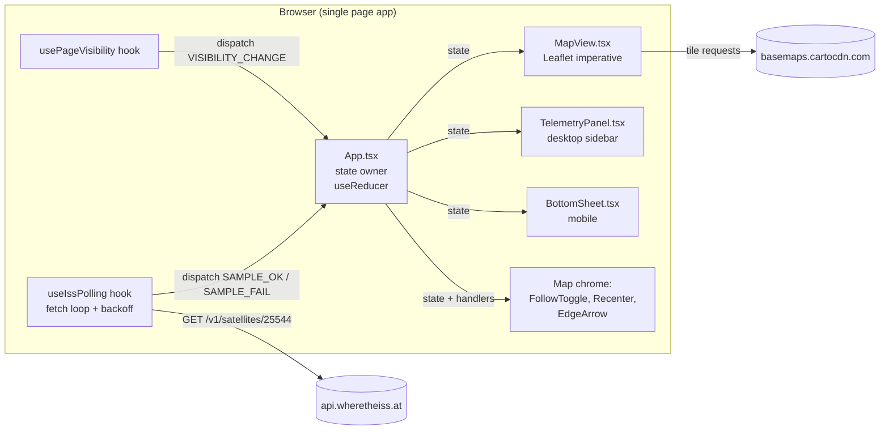

# System Design — ISS Live Tracker

> Last updated: 2026-06-02
> Status: initial draft (iteration 1, pre-implementation)
> Serves: prd-001

## 1. System Overview & Guiding Philosophy

ISS Live Tracker is a **single-page, single-purpose, client-only web app**. It polls one public REST endpoint every 5 seconds, renders the result on a dark Leaflet map with a fading polyline trail, and exposes a small telemetry panel. There is no backend, no auth, no persistence, no build-time data, no analytics.

**Guiding principles** (drive every cross-cutting decision below):

1. **One job, done beautifully.** The product is a glance-and-go tracker. Every architectural choice prefers fewer moving parts over flexibility we won't use.
2. **Client-only.** No server-side rendering, no API proxy, no edge functions. The browser talks directly to `api.wheretheiss.at`. This is acceptable because the API is public, CORS-enabled, key-less, and tolerant of our cadence.
3. **Minimal file count.** Per the user brief: "as few files as possible." A senior reader should be able to grasp the entire app in 10 minutes. We default to colocating related concerns until a file genuinely needs to be split.
4. **State lives in one place.** A single `useReducer` (or a single `useState` object) at the `App` level owns the entire app state. No Redux, no Zustand, no Context-per-feature, no module-level mutables. Components receive what they need via props.
5. **Imperative Leaflet, declarative React.** React owns app state and UI chrome. Leaflet owns map rendering, layers, and gestures. The boundary is one or two thin "effect" hooks that translate state diffs into Leaflet calls (`marker.setLatLng`, `polyline.setLatLngs`, `map.flyTo`). We use `react-leaflet` for the initial mount + `<TileLayer />` only; for marker/polyline/animation we use Leaflet directly inside `useEffect`s because react-leaflet's per-render reconciliation does not give us smooth 5s interpolation.
6. **Side effects are isolated.** Polling, animation tweening, Page Visibility, and Leaflet imperative calls live in dedicated hooks. UI components are dumb: they receive state and render.
7. **Graceful degradation by default.** Every code path either updates state or no-ops. Errors never throw upward; they become state (`status: 'reconnecting'`, `lastError`).

## 2. Tech Stack

| Layer | Choice | Version constraint | Rationale |
|---|---|---|---|
| Build tool | **Vite** | `^5.x` | Fast HMR, first-class React + TS support, near-zero config, single-page-app default. User-specified. |
| Language | **TypeScript** | `^5.x` | Catches the entire class of "did the API return what we expected" bugs at the boundary. The app is small enough that TS overhead is trivial. **Decision: TS over JS** (see §10). |
| UI framework | **React** | `^18.x` | User-specified. Concurrent rendering not needed; we use the classic effect model. |
| Styling | **Tailwind CSS** | `^3.x` | User-specified. Matches the utility-class density already shown in mocks (`bg-slate-950/90`, `backdrop-blur`, etc.). |
| Map | **Leaflet** | `^1.9.x` | Mature, lightweight (~42KB gzipped), works with raster tiles, supports the imperative animation we need. |
| Map (React) | **react-leaflet** | `^4.2.x` (compatible with React 18 + Leaflet 1.9) | Provides `<MapContainer>` + `<TileLayer>` mount/unmount lifecycle. We do NOT use its `<Marker>` / `<Polyline>` components — see §6. |
| Tile source | **CartoDB Dark Matter** (no-labels not used; default labeled) | `https://{s}.basemaps.cartocdn.com/dark_all/{z}/{x}/{y}{r}.png` | PRD-resolved decision. Dark by design, OSM-based, free, CDN-served. |
| HTTP | **`fetch` (built-in)** | n/a | One request, no headers, no body. No need for axios. `AbortController` cancels in-flight requests on unmount or visibility change. |
| Testing | **Vitest** + **@testing-library/react** | latest | Only if/when CUJ-6 memory test or polling unit test is needed. Not blocking v1. |
| Linter / formatter | **ESLint** (vite default) + **Prettier** (optional) | latest | Default Vite React-TS template. |

**Explicitly rejected:**
- **Next.js / Remix / SvelteKit**: SSR adds complexity for zero benefit on a single page that has no SEO opportunity beyond a static title.
- **Redux / Zustand / Jotai**: one screen, ~8 fields of state. `useReducer` is more than enough.
- **Axios / TanStack Query**: polling logic is bespoke (backoff + visibility-aware), and the lib would obscure the small amount of logic we have.
- **D3 / Mapbox GL**: way over budget for a polyline + a dot.
- **Styled-components / Emotion**: Tailwind is mandated; mixing CSS-in-JS would double the styling system.

## 3. Architecture Overview



**Single-direction data flow:** poll hook fetches → dispatches to reducer → reducer updates state → React re-renders → MapView's `useEffect` diffs and calls Leaflet imperatively → user sees smooth motion.

## 4. Directory Layout (canonical)

The user brief mandates a minimal file count. This is the target:

```
iss_tracker/
├── index.html                  # Vite entry; <div id="root">
├── package.json
├── tsconfig.json
├── vite.config.ts
├── tailwind.config.js
├── postcss.config.js
├── public/
│   └── (favicon.svg — optional)
└── src/
    ├── main.tsx                # ReactDOM.createRoot + import 'leaflet/dist/leaflet.css' + import './index.css'
    ├── index.css               # Tailwind directives + a few global CSS vars
    ├── App.tsx                 # Top-level layout, useReducer, wiring of hooks → components
    ├── state.ts                # State type, action types, reducer, initial state
    ├── api.ts                  # fetchIssPosition(): single function, all parsing + type narrowing here
    ├── hooks/
    │   ├── useIssPolling.ts    # 5s loop, backoff, AbortController, Page Visibility awareness
    │   └── usePageVisibility.ts
    ├── components/
    │   ├── MapView.tsx         # react-leaflet <MapContainer>+<TileLayer>; imperative marker/trail effects
    │   ├── TelemetryPanel.tsx  # desktop right panel (>=768px)
    │   ├── BottomSheet.tsx     # mobile bottom sheet (<768px), collapsed/expanded
    │   ├── FollowToggle.tsx    # top-right toggle (shared desktop+mobile)
    │   ├── RecenterButton.tsx  # FAB shown when follow=off and ISS off-screen
    │   ├── EdgeArrow.tsx       # off-screen direction indicator
    │   └── ConnectionStatus.tsx# LIVE / RECONNECTING pill + "Reconnecting…" inline message
    └── constants.ts            # palette, breakpoints, polling cadence, trail size, API URL
```

**File count target: ~15 source files + 6 config files.** Anything beyond this should be questioned. We deliberately do NOT split:
- Each telemetry field into its own component (six fields share one row pattern; render inline).
- A separate `types.ts` (types live next to the code that uses them; shared types live in `state.ts`).
- A separate `utils.ts` (each util — formatLat, formatDuration, antimeridian split — lives next to its consumer or in `state.ts` if cross-cutting).

If a file exceeds ~300 lines, *then* extract. Not before.

## 5. State Shape (single source of truth)

```ts
// src/state.ts

export type IssSample = {
  lat: number;            // degrees, -90..90
  lon: number;            // degrees, -180..180
  altitudeKm: number;     // km
  velocityKmh: number;    // km/h
  visibility: 'daylight' | 'eclipsed' | 'unknown';
  apiTimestampMs: number; // API's reported time, in ms (we multiply by 1000)
  receivedAtMs: number;   // performance.now()-aligned wall clock when we got the response
};

export type TrailPoint = {
  lat: number;
  lon: number;
  receivedAtMs: number;
};

export type ConnectionStatus =
  | 'idle'           // before first fetch
  | 'connecting'     // first fetch in-flight
  | 'live'           // last fetch succeeded; cadence is 5s
  | 'reconnecting';  // >=2 consecutive failures; backoff active

export type State = {
  // Live data
  current: IssSample | null;       // last good sample
  previous: IssSample | null;      // sample before current; used as interpolation start
  trail: TrailPoint[];             // bounded array, max 20

  // Map view intent
  follow: boolean;                 // true = auto-center on each new sample
  isMarkerOnScreen: boolean;       // updated by MapView on viewport change; drives EdgeArrow + Recenter
  hasShownFollowToast: boolean;    // gate the "Follow off — map won't auto-center" toast to once/session

  // Connection
  status: ConnectionStatus;
  consecutiveFailures: number;     // resets to 0 on success; drives backoff
  nextPollAtMs: number | null;     // scheduled time of next attempt (for debugging/visuals if needed)

  // Mobile sheet
  isSheetExpanded: boolean;

  // Tick
  nowMs: number;                   // ticked every 1s so "Last updated" relative time stays accurate
};

export type Action =
  | { type: 'POLL_START' }
  | { type: 'SAMPLE_OK'; sample: IssSample }
  | { type: 'SAMPLE_FAIL' }
  | { type: 'SET_FOLLOW'; follow: boolean; userInitiated: boolean }
  | { type: 'MAP_INTERACTED' }                         // user pan/zoom; auto-disables follow
  | { type: 'MARKER_VISIBILITY_CHANGE'; onScreen: boolean }
  | { type: 'TOGGLE_SHEET' }
  | { type: 'COLLAPSE_SHEET' }
  | { type: 'TICK'; nowMs: number }
  | { type: 'VISIBILITY_CHANGE'; visible: boolean };
```

**Why a single reducer:**
- The state graph has six interdependent transitions (`SAMPLE_OK` resets failure count AND moves `current → previous` AND appends to trail AND may flip status). A reducer keeps these together and atomic.
- Components stay pure: they receive a snapshot, render, and dispatch.
- Trivially testable: pass an initial state + an action, assert the next state. No mocks needed.

**Backoff is derived, not stored.** The next delay is `delayFor(consecutiveFailures)` (see §7). We do not store the delay in state — only the failure count.

## 6. Cross-cutting: Marker & Trail Rendering (the most subtle part)

This belongs in `system.md` because both `MapView`, `state.ts`, and the polling hook conspire to make it correct.

### 6.1 Smooth marker animation

**Problem:** new sample arrives every ~5s. If we just `marker.setLatLng(new)` on each update, the marker teleports. We want continuous motion.

**Decision: linear-interpolated tween between `previous` and `current`, driven by `requestAnimationFrame`.**

- The polling hook never animates. It only dispatches `SAMPLE_OK` with the new sample. The reducer moves the old `current` into `previous` and sets the new `current`.
- `MapView` runs a single `useEffect` keyed on `[current?.receivedAtMs]`. When it fires:
  1. Cancel any in-flight `rAF` tween.
  2. If `previous` is null OR the gap between `previous.receivedAtMs` and `current.receivedAtMs` is > 8000ms (long outage / first sample / post-resume), do a **fade jump**: hide marker (opacity 0, 200ms), `setLatLng(current)`, fade in (200ms). No interpolation.
  3. Otherwise, start a tween of duration `min(current.receivedAtMs - previous.receivedAtMs, 5000)` ms. Each `rAF` frame:
     - `t = clamp((now - tweenStart) / duration, 0, 1)`
     - Interpolate via `shortPathInterp(prev, curr, t)` (see §6.3 for antimeridian).
     - `marker.setLatLng([interpLat, interpLon])`.
     - If `t >= 1`, stop.
- **Tween does NOT extrapolate past `current`.** If the next poll is late, the marker holds at the last known position. PRD CUJ-1 requires this.

**Why linear, not great-circle:** at 5s and ~7.66 km/s, the ISS travels ~38 km between samples. Over that distance, the difference between a great-circle path and a linear lat/lon path is visually indistinguishable on a zoom 3 map. Linear is simpler and cheaper.

**Why rAF and not CSS transitions:** Leaflet renders the marker into the map's pixel-coordinate DOM. As the user pans/zooms during the tween, the marker's screen position must re-project. Only `setLatLng` (called inside rAF) gives us this for free.

### 6.2 Trail rendering

- Trail is a `L.polyline` mounted once in `MapView`'s mount effect. On each `current` change, we call `polyline.setLatLngs(splitOnAntimeridian(state.trail))`.
- **Opacity gradient.** Leaflet's single polyline has one opacity. To get the newest-to-oldest fade, we render the trail as a **stack of N small polylines** (one per segment), where N = `trail.length - 1`. Each segment polyline has opacity `0.1 + 0.9 * (i / (N-1))` (oldest = 0.1, newest = 1.0). Stroke width 2px, color `#22d3ee`.
  - With N ≤ 19 segments, this is 19 layers max — negligible cost.
  - Alternative considered: SVG `linearGradient` along the path. Rejected: Leaflet polylines don't natively accept SVG gradients per-segment; would require custom SVG layer. Not worth the complexity for v1.
- **Trail array management** lives in the reducer:
  - On `SAMPLE_OK`: append `{lat, lon, receivedAtMs}` to `trail`; if `trail.length > 20`, drop oldest.
  - On `VISIBILITY_CHANGE` to hidden: do nothing to the trail (it's preserved).
  - On `VISIBILITY_CHANGE` to visible: also do nothing here — the next `SAMPLE_OK` will be appended; the gap is implicit (the previous trail point's receivedAtMs is far older than the new one).
- **Gap visualization on resume / long outage:** because each "segment" is rendered as its own polyline, we simply *skip* drawing the segment whose two endpoints have `receivedAtMs` more than 8000ms apart. The result: pre-outage trail and post-outage trail appear as two disconnected fragments, with empty space between. This satisfies CUJ-5 and CUJ-6 acceptance criteria.

### 6.3 Antimeridian crossing

The map is `worldCopyJump: true` in Leaflet config, which means longitude can be normalized to ±180° at viewport edges. But our trail polyline data is in true geographic coordinates: a segment from `lon=179` to `lon=-179` will draw a line across the entire map (the wrong way around the world).

**Decision: split segments at antimeridian crossings.**

A helper `splitOnAntimeridian(trail: TrailPoint[]): TrailPoint[][]`:
- Walks the trail.
- If `abs(trail[i].lon - trail[i-1].lon) > 180`, end the current sub-array and start a new one at `trail[i]`.
- Returns an array of sub-trails, each rendered as its own polyline (already the case per §6.2's per-segment rendering — we just skip the bridge segment).

For the **marker tween**, `shortPathInterp(a, b, t)`:
- If `abs(b.lon - a.lon) <= 180`: standard linear interp on both lat and lon.
- Else: take the shorter wrap. E.g., a=179, b=-179: treat b as 181, interp, then `((result + 180) % 360) - 180` to normalize back.
- This gives the visually correct "marker exits right edge, re-enters left edge" behavior when paired with `worldCopyJump: true`.

## 7. Cross-cutting: Polling & Backoff

A single hook, `useIssPolling(dispatch, isVisible)`, owns the entire polling lifecycle.

### 7.1 Cadence

- Healthy state: 5000 ms between successive `fetch` calls (measured response-to-next-request).
- On failure: backoff schedule `[5000, 10000, 20000, 30000]`, indexed by `consecutiveFailures`. Beyond index 3, stay at 30000.
  - i.e., `delayFor(failures) = [5000, 10000, 20000, 30000][min(failures, 3)]`.
  - Reading: the *next attempt after* failure N uses index N (after first failure → 5000 — silent retry; after second → 10000; etc.).
  - This matches CUJ-5 schedule: `5s (silent), 10s, 20s, 30s, 30s, ...`.

### 7.2 Mechanism

- One `setTimeout` chain — not `setInterval`. Each successful or failed fetch schedules the next.
- `AbortController` per request, stored in a ref. Aborted on:
  - Component unmount.
  - `usePageVisibility` transitions to hidden.
- Fetch with a hard 8000ms timeout (`setTimeout` → `controller.abort()`). Any non-2xx, network error, abort, or JSON parse failure → `SAMPLE_FAIL`.
- Success path: parse with `api.ts`'s `parseIssResponse` (type-narrow + bounds-check). If it throws or returns `null`, treat as failure.

### 7.3 Page Visibility integration

- `usePageVisibility` is a small hook returning the current `document.visibilityState === 'visible'` and reacting to `visibilitychange` events.
- `useIssPolling` reads `isVisible`. When it flips:
  - **visible → hidden**: abort in-flight request, clear pending `setTimeout`.
  - **hidden → visible**: immediately fire one fetch (no delay), then resume normal scheduling.
- Reducer also gets `VISIBILITY_CHANGE` (separate dispatch from `usePageVisibility`'s `useEffect`) so it can mark `status: 'connecting'` briefly on resume, etc.

### 7.4 The 1s ticker for "Last updated"

- Separate `useEffect` in `App.tsx`: `setInterval(() => dispatch({type:'TICK', nowMs: Date.now()}), 1000)`.
- Pause this interval too when hidden (cheap; just avoids needless React re-renders in a backgrounded tab).
- Components compute relative-time strings from `state.nowMs - state.current.receivedAtMs`.

## 8. Cross-cutting: Visual Design Tokens

Extracted from `MOCK_BRIEF.md` and verified against actual HTML mocks. These belong in Tailwind config and/or `constants.ts` and should NEVER be hardcoded at call sites.

| Token | Value | Usage |
|---|---|---|
| `bg.app` | `#0d1117` | App background, map base |
| `bg.map` | `#0a0f17` | Inside-map dark |
| `bg.panel` | `#11161f` | Side panel solid bg |
| `bg.card` | `#1a212e` | Telemetry value cards |
| `bg.glass` | `rgba(22,27,34,0.78)` | Floating chrome (toggle, title chip, edge arrow) |
| `bg.glass-soft` | `rgba(22,27,34,0.62)` | Marker label, secondary chrome |
| `accent.cyan` | `#22d3ee` | ISS marker, Follow ON, Recenter FAB, edge arrow |
| `accent.cyan-soft` | `#7dd3fc` | Toggle on-state text, satellite icon |
| `accent.green` | `#22c55e` | LIVE dot, healthy indicators |
| `accent.amber` | `#f59e0b` | Sun icon, RECONNECTING pill, stale timestamp |
| `text.primary` | `#f0f6fc` | Telemetry values, headers |
| `text.secondary` | `#e6edf3` | Body text |
| `text.muted` | `#8b949e` | Labels, sub-text |
| `text.dim` | `#6e7681` | Attribution, footer meta |
| `border.subtle` | `rgba(240,246,252,0.06–0.10)` | Card borders, panel divider |

| Animation | Duration | Easing | Usage |
|---|---|---|---|
| Live dot pulse | 1.5s | ease-in-out infinite | Green LIVE dot |
| Reconnecting pulse | 3s | ease-in-out infinite | Amber dot when reconnecting |
| Marker halo | 2.2s | ease-out infinite | Cyan ring expanding from marker |
| Marker fade | 200ms | ease | Jump-in / jump-out on long gaps |
| Map `flyTo` (follow) | 1500ms | Leaflet default cubic | Recenter / first lock-on |
| Map `flyTo` (first load) | 1000ms | Leaflet default cubic | Initial center-on-ISS |
| Sheet expand/collapse | 300ms | ease-out | Mobile bottom sheet |
| Toast appear/dismiss | 200ms / 2000ms hold | ease | Follow-off toast |

| Breakpoint | Value |
|---|---|
| Mobile/desktop split | `768px` (`md:` in Tailwind, default config) |
| Desktop panel width | `360px` (per mocks; PRD said 320, but mocks consistently use 360 — adopt 360) |
| Mobile sheet collapsed | `~80px` |
| Mobile sheet expanded | `~50vh` (≈ 470px on 390×844 device per mock) |

**One discrepancy resolved here:** PRD §CUJ-1 says "side panel ~320px wide"; mocks render 360px. **Decision: use 360px** (matches all current mocks; PRD's 320 was an estimate written before mocks).

## 9. Cross-cutting: Error Handling & Resilience

| Failure | Detection | Behavior | UI signal |
|---|---|---|---|
| Network error / timeout | `fetch` rejects or AbortController fires | `SAMPLE_FAIL` | None if failures==1; "RECONNECTING" pill + amber "Last updated" if ≥2 |
| Non-2xx (including 429, 5xx) | `response.ok === false` | `SAMPLE_FAIL` | Same as above |
| Malformed JSON / missing fields | `parseIssResponse` returns `null` | `SAMPLE_FAIL` | Same as above |
| Tile load failure | Leaflet default broken-tile placeholder | None at app layer | Light gray squares; marker/trail render over them |
| React render error | Top-level `<ErrorBoundary>` (single, in `App.tsx`) | Catches throw; shows static fallback panel "Something went wrong. The tracker is reloading…" with a `window.location.reload()` after 5s | Full-screen recovery; should be impossible to trigger |
| `wheretheiss.at` permanently down | Cumulative failures → permanent reconnecting state | Continues retrying every 30s indefinitely; never crashes | RECONNECTING pill remains; stale data shown |

**Never:** raw error strings, stack traces, alerts, console-only failures. All states must be reachable and recoverable from the UI.

## 10. Cross-cutting: TypeScript vs JavaScript

**Decision: TypeScript.**

Trade-offs:
- (+) The API boundary is the only place a runtime surprise can happen. `parseIssResponse` with TS types is the single chokepoint where we validate `latitude`/`longitude`/`altitude`/`velocity`/`visibility` exist and are the right types. Once past this, the entire app is type-safe.
- (+) Reducer + action discriminated unions catch dispatch typos and missing cases at compile time. For a state machine of 9 actions, this pays off immediately.
- (+) Cost is trivial: ~5 type definitions for the whole app.
- (−) `tsc` adds one build dependency. Acceptable.

**Type-checking is enforced.** `npm run typecheck` (`tsc --noEmit`) must be zero-error. CI should run it.

## 11. Cross-cutting: Performance

| Metric | Target | Measurement |
|---|---|---|
| First contentful paint | < 1.5s on 4G mobile | Lighthouse mobile |
| First marker on map | < 2.5s | wall-clock from navigation start to first `marker.setLatLng` |
| Marker animation frame rate | 60fps on 2020-era mobile | Chrome DevTools perf trace |
| JS bundle size | < 200KB gzipped (incl. Leaflet) | `vite build` output |
| Memory after 1 hour | within 10MB of baseline | DevTools heap snapshot |

**Bundle estimate:** React (~45KB) + Leaflet (~42KB) + react-leaflet (~12KB) + Tailwind (purged, ~10KB) + app code (~10KB) ≈ **~120KB gzipped**. Comfortably under target.

**The "free" optimizations we get without doing anything:**
- Vite produces a single-page bundle with code-splitting only for dynamic imports (we have none).
- Tailwind's JIT mode purges unused classes.
- Leaflet tile loading is browser-cached.

**Optimizations we explicitly skip in v1:**
- Service worker / PWA / offline cache.
- Tile preloading.
- Lazy-loading the side panel (it's tiny).

## 12. Cross-cutting: Accessibility

- All interactive controls (Follow toggle, Recenter button, sheet chevron) reachable by Tab and operable with Space/Enter.
- Follow toggle uses `role="switch"` with `aria-checked`.
- Recenter button has `aria-label="Recenter map on ISS"`.
- Visibility values use icon + text (never color-only).
- LIVE / RECONNECTING pills have `aria-live="polite"` so screen readers announce state changes.
- "Last updated" has `aria-live="polite"` with `aria-atomic="true"` (announced when stale).
- All text against dark background meets WCAG AA: `#e6edf3` on `#0d1117` is contrast ratio ~14:1; `#8b949e` on `#11161f` is ~5.4:1 (passes AA for normal text).

## 13. Cross-cutting: Browser Support

- Targets: last-2 Chrome, Safari, Firefox, Edge on desktop; iOS Safari 16+, Android Chrome 110+ on mobile.
- Vite's default `target: 'baseline-widely-available'` is acceptable; if bundle bloat matters, set `target: ['es2020']`.
- `backdrop-filter` is used heavily in mocks. Supported on all targets (iOS Safari 14+, Chrome 76+, Firefox 103+). Fallback: solid `bg-slate-900` if `@supports not (backdrop-filter: blur(10px))`. Acceptable degradation.
- No IE11. No transpile to ES5.

## 14. Cross-cutting: Configuration Constants

All in `src/constants.ts`. Components import from here; nothing is hardcoded at call sites.

```ts
export const API_URL = 'https://api.wheretheiss.at/v1/satellites/25544';
export const TILE_URL = 'https://{s}.basemaps.cartocdn.com/dark_all/{z}/{x}/{y}{r}.png';
export const TILE_ATTRIBUTION =
  '&copy; <a href="https://www.openstreetmap.org/copyright">OpenStreetMap</a> contributors &copy; <a href="https://carto.com/attributions">CARTO</a>';

export const POLL_BASE_MS = 5000;
export const POLL_BACKOFF_MS = [5000, 10000, 20000, 30000] as const;
export const FETCH_TIMEOUT_MS = 8000;

export const TRAIL_MAX_POINTS = 20;
export const TRAIL_GAP_THRESHOLD_MS = 8000; // segments with larger receivedAtMs gap are not drawn

export const STALE_THRESHOLD_MS = 30_000;
export const RECONNECT_AFTER_FAILURES = 2;

export const INITIAL_MAP_CENTER: [number, number] = [0, 0];
export const INITIAL_MAP_ZOOM = 2;
export const ISS_LOCK_ZOOM = 3;
export const FLY_TO_DURATION_INITIAL_S = 1.0;
export const FLY_TO_DURATION_RECENTER_S = 1.5;

export const BREAKPOINT_MOBILE_PX = 768;
```

## 15. Cross-cutting: Testing Strategy

Not blocking v1 launch, but defined so we know where to put tests when added.

- **Reducer**: pure-function tests in `state.test.ts`. Cover all 9 actions, especially `SAMPLE_OK` → consecutiveFailures reset, trail append + cap, status transition.
- **API parser**: `api.test.ts`. Valid response, missing fields, wrong types, unknown visibility → all should yield correct result or `null`.
- **Polling backoff**: `useIssPolling.test.ts` with `vi.useFakeTimers()`. Verify delay sequence.
- **Antimeridian helpers**: `mapView.test.ts` (or wherever they live). Verify split behavior at boundaries.
- **No component snapshot tests.** Brittle, low value.

## 16. Cross-cutting: Deployment

- Static site. `npm run build` → `dist/`. Deploy anywhere that serves static files: Vercel, Netlify, GitHub Pages, Cloudflare Pages, S3+CloudFront.
- No environment variables. API URL is hardcoded (public).
- HTTPS required (because we call `https://api.wheretheiss.at`). Mixed-content blocked otherwise.
- One CDN concern: CartoDB tiles are subject to their fair-use policy. At our expected scale (hundreds of concurrent users), zero concern. If usage grows, switch to self-hosted tiles or another provider — single line change in `constants.ts`.

## 17. Data Flow End-to-End

```mermaid
sequenceDiagram
    autonumber
    participant U as User
    participant V as usePageVisibility
    participant P as useIssPolling
    participant API as wheretheiss.at
    participant R as Reducer / State
    participant M as MapView (Leaflet)
    participant TP as TelemetryPanel

    U->>V: opens tab (visible)
    V->>P: isVisible=true
    P->>API: GET /v1/satellites/25544
    API-->>P: 200 OK { lat, lon, ... }
    P->>R: dispatch SAMPLE_OK
    R-->>M: state.current updated
    R-->>TP: state.current updated
    M->>M: tween prev→curr via rAF
    M->>M: append trail point, redraw N polylines
    TP->>TP: format & render numbers

    loop every 1s
        R->>R: TICK → updates nowMs
        TP->>TP: re-render "Last updated" relative time
    end

    Note over P,API: 5s later: next poll
    P->>API: GET ...
    API--xP: network error
    P->>R: dispatch SAMPLE_FAIL (consecutiveFailures = 1)
    Note over R: still status=live (1 failure is silent)
    P->>P: schedule next in 5s

    Note over P,API: another 5s: still failing
    P->>API: GET ...
    API--xP: error
    P->>R: dispatch SAMPLE_FAIL (consecutiveFailures = 2)
    R-->>TP: status → 'reconnecting'
    TP->>TP: show RECONNECTING pill + inline message
    P->>P: schedule next in 10s (backoff index 2)

    U->>V: switches tabs (hidden)
    V->>P: isVisible=false
    P->>P: abort in-flight, clear scheduled timer
    Note over R,M: state frozen; marker holds

    U->>V: returns (visible)
    V->>P: isVisible=true
    P->>API: GET ... (immediate)
    API-->>P: 200 OK
    P->>R: SAMPLE_OK (gap > 8s ⇒ MapView fade-jump)
    R-->>M: state.current updated, gap detected
    M->>M: fade out, setLatLng(new), fade in (no tween)
    M->>M: new trail segment starts; old segments preserved; bridge segment skipped
```

## 18. Open Engineering Questions

- **Marker visual: SVG satellite icon vs. simple glowing dot?** Mocks consistently render a glowing dot with `.iss-marker::after` halo ring. **Recommendation: ship the glowing dot for v1** (matches mocks exactly; zero asset work). If future polish wants an SVG satellite, swap to a `L.divIcon` with embedded SVG — single-file change in MapView.
- **Should we add a `noscript` warning?** Single-line cost. Recommended yes — without JS, the app is a blank page. Add to `index.html`.
- **Reduced motion preference?** `@media (prefers-reduced-motion: reduce)` could disable marker halo + LIVE pulse + sheet expand animation. Recommended for v1 — single CSS rule.
- **Map keyboard navigation for accessibility:** Leaflet supports arrow-key panning by default when the map has focus. We rely on this; no extra work needed.

## 19. PRDs Served by This System

| PRD | Notes |
|---|---|
| `prd-001-iss-live-tracker` | All six CUJs (1–6, all P0). Drives every decision above. |

---

> **For implementers:** if this document is ambiguous on a decision, choose the option that (a) preserves the minimal-file-count principle, (b) keeps state in one reducer, (c) keeps Leaflet imperative and React declarative. Then flag the ambiguity for resolution.
